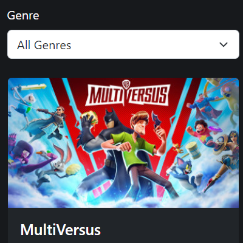

# Free Games

Free Games app using Angular, RxJS, TypeScript, and the Free To Play Games Database API.

## Getting Started

1. Clone the repo  
  `git clone https://github.com/nightwolfdev/freegames.git`
2. Navigate to the project folder  
  `cd freegames`
3. Install dependencies  
  `npm install`
4. Run the app  
  `ng serve`
5. Visit the app in a browser  
  `http://localhost:4200`

## Links

* [Demo](https://nightwolf.dev/demos/freegames)
* [Angular](https://angular.io)
* [RxJS](https://rxjs.dev)
* [TypeScript](https://www.typescriptlang.org)
* [Free To Play Games Database API](https://www.freetogame.com/api-doc)